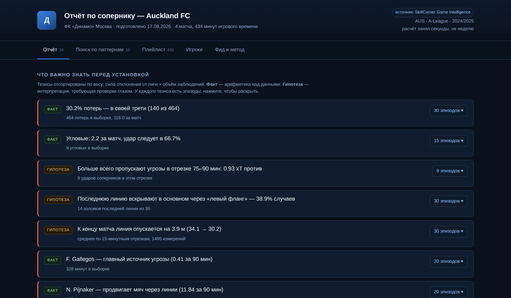
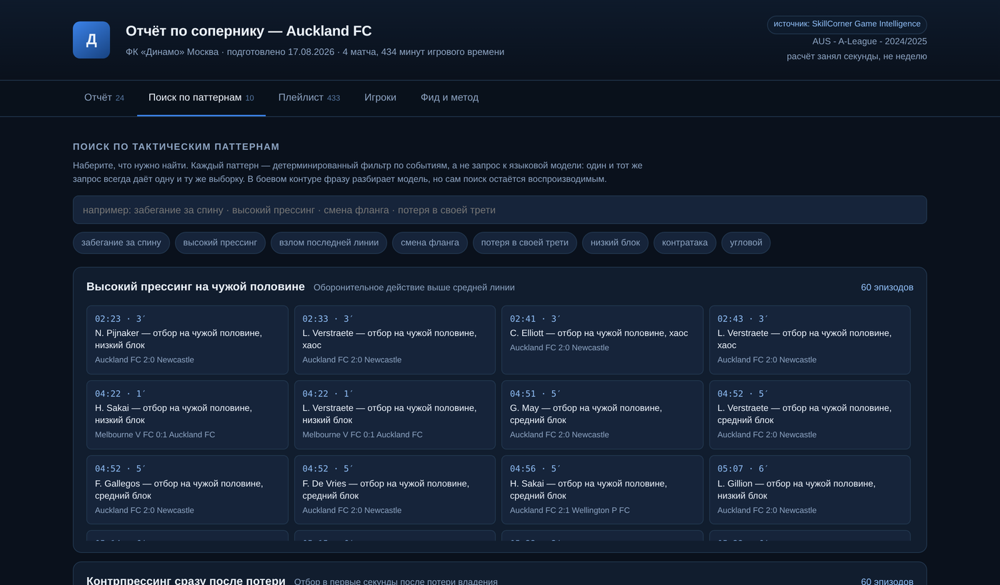
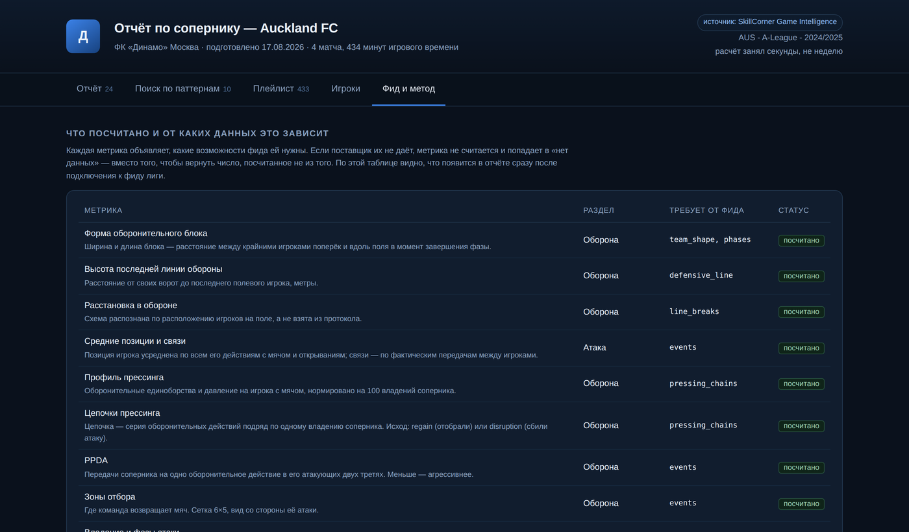

# Такт — предматчевый отчёт по сопернику

[](https://github.com/danill3gacy/takt/actions/workflows/ci.yml)
[](https://www.python.org/)
[](LICENSE)
[](https://github.com/SkillCorner/opendata)

Надстройка над данными лиги для тренерского штаба. Забирает у видеоаналитика механику —
выгрузку, сведение, разметку, нарезку — и к утру отдаёт собранный отчёт по сопернику,
где **каждый тезис кликается в эпизоды**.

Не «ИИ вместо аналитика». Аналитик перестаёт работать руками и начинает работать головой:
система готовит материал, он проверяет, спорит, добавляет то, что видит глазом, и несёт
тренеру уже своё.



## Запустить за три команды

Демонстрация работает на открытом датасете, без доступов и ключей — отчёт на скриншотах
выше собирается ровно этими командами:

```bash
pip install -r requirements.txt
git clone --depth 1 https://github.com/SkillCorner/opendata.git data/skillcorner
python -m takt.cli report --team "Auckland FC" --out out/report.html
```

Сбор занимает около минуты на ноутбуке. На выходе — один HTML-файл: открывается с диска,
работает без сервера и интернета, его можно переслать в мессенджере тренеру.

Посмотреть, какие команды доступны в выборке:

```bash
python -m takt.cli matches --team "Auckland FC"
```

## Как читается отчёт

Пять вкладок, каждая отвечает на свой вопрос штаба.

**Отчёт** — 24 тезиса, отсортированных по весу доказательства. У каждого метка `ФАКТ` или
`ГИПОТЕЗА`, подпись с объёмом выборки и кнопка с числом эпизодов: нажатие раскрывает список
моментов с тайм-кодами. Ниже — карты и распределения: средние позиции и связи передач, форма
блока без мяча, высота последней линии по фазам, карта созданной угрозы, зоны возврата мяча,
ритм матча, стандарты.

**Поиск по тактическим паттернам** — набираете «забегание за спину» или «потеря в своей трети»
и получаете выборку эпизодов. Каждый паттерн — детерминированный фильтр по событиям, а не
запрос к языковой модели: один и тот же запрос всегда даёт одну и ту же выборку. В боевом
контуре фразу разбирает модель, но сам поиск остаётся воспроизводимым.



**Плейлист** — 433 эпизода одним списком, с фильтрами. **Игроки** — таблица с нормировкой на
90 минут и ключевые исполнители. **Фид и метод** — то, что обычно прячут: какая метрика что
требует от источника и что из этого посчитано на вашем фиде.



## Задача

Подготовка к матчу упирается в механику. Видеоаналитик два-три дня выгружает данные, сводит
матчи в одну систему координат, считает метрики, ищет и режет эпизоды. К совещанию тренер
получает презентацию, в которой утверждения нельзя проверить: чтобы увидеть эпизод за тезисом,
нужно снова идти к аналитику. Чем ближе тур, тем больше в отчёте «мне показалось» и меньше
проверяемого.

| Показатель | Значение |
|---|---|
| Метрик в отчёте | **19** в 6 разделах: оборона, атака, движение без мяча, игроки, стандарты, ритм |
| Типов данных фида | **11** объявленных `Capability` — от событий и трекинга до цепочек прессинга и xThreat |
| Сборка отчёта | **~1 минута** против двух-трёх дней ручной работы |
| Кодовая база | ~3 100 строк Python, 19 модулей, ноль внешних зависимостей в самом отчёте |
| Тесты | **17**, прогоняются в CI на открытом датасете, Python 3.11 и 3.12 |
| Подключение новой лиги | **1 адаптер**, логика метрик не меняется ни на строку |

## Архитектура

| Слой | Файл | Отвечает за |
|---|---|---|
| Модель | `takt/model.py` | Единое представление матча: события + трекинг, любой поток может отсутствовать |
| Источники | `takt/sources/` | Адаптеры поставщиков. Один файл на поставщика |
| Метрики | `takt/metrics/` | Расчёты. Каждая объявляет, что ей нужно от фида |
| Лига | `takt/baseline.py` | Медиана по всем командам выборки — контекст для чисел |
| Тезисы | `takt/insights.py` | Автогенерация выводов с весом и привязкой к эпизодам |
| Отчёт | `takt/report.py` | Сборка модели отчёта + поиск по тактическим паттернам |
| Рендер | `takt/render/` | Самодостаточный HTML без внешних зависимостей |

## Четыре решения, на которых держится доверие штаба

### 1. Контракт между метрикой и источником

**Метрика объявляет, что ей нужно от фида. Источник объявляет, что он умеет.** Нет
пересечения — метрика не считается и уходит в раздел «нет данных» вместо того, чтобы вернуть
число, посчитанное не из того.

```python
@metric("defensive_line", "Высота последней линии", "Оборона",
        requires=(Capability.DEFENSIVE_LINE,))
def defensive_line(ms: MatchSet) -> dict:
    ...
```

Мы не знаем заранее, что отдаёт фид конкретной лиги. Подключение нового поставщика — это новый
адаптер и честная декларация возможностей; клуб на вкладке «Фид и метод» сразу видит, какие
блоки отчёта у него появятся, а какие нет. Тихая деградация числа — самый опасный сценарий в
аналитике, и здесь он закрыт архитектурно.

### 2. Граница автоматизации проведена в коде, а не в презентации

**Автоматизируется полностью — всё проверяемое.** Цифры, карты, распределения, нарезка
эпизодов, поиск по паттернам, сравнение с лигой. Ошибаться тут нечему: это арифметика над
данными. В отчёте помечено как `ФАКТ`.

**Автоматизируется как гипотеза — тактические выводы.** Не «они делают X», а «в N эпизодах из M
это выглядит так — вот все N, посмотри». Система не утверждает, она показывает и ранжирует по
весу доказательства. В отчёте помечено как `ГИПОТЕЗА`.

**Не автоматизируется — то, что тренер скажет команде.** Это его работа.

Отсюда правило, закреплённое тестом: **тезис без эпизодов не выпускается**. Если утверждение
нельзя проверить за два клика, его нет.

```python
def test_every_insight_has_clips(...):
    for i in insights:
        assert i.clips, f"тезис без эпизодов не должен выпускаться: {i.text}"
```

### 3. Вес тезиса

```
вес = 0.65 × сила отклонения от лиги + 0.35 × уверенность от объёма выборки
```

Отчёт, где всё важно, не читают. Тезисы сортируются по весу, цветовая градация — по нему же.
Отклонение без объёма — это шум, объём без отклонения — это норма лиги; наверх поднимается
только то, где есть и то, и другое.

### 4. Система координат под тестами

`x ∈ [−52.5, +52.5]`, `y ∈ [−34, +34]`, метры, начало — центр поля. Ось x направлена в сторону
атаки команды, владеющей мячом. Сведение всех матчей к системе одной команды —
`Match.frame_of(team_id)`.

Это самое опасное место в проекте: ошибка знака не роняет расчёт, а тихо переворачивает
половину выводов. Поэтому на систему координат отдельные тесты: вратарь обязан оказаться у
своих ворот, нападающий — впереди защитников, левый канал — по одну сторону от центра.

## Подключение к фиду лиги

`takt/sources/yandex.py` — рабочая точка подключения с описанным контрактом и списком вопросов,
которые нужно закрыть до начала работ. Порядок не случайный: первые два определяют, проект это
на три месяца или на полтора года.

1. Отдаётся ли сырой трекинг или только производные события?
2. Есть ли поверх трекинга забегания, цепочки прессинга, взломы линий?
3. Формат и частота выгрузки, глубина истории.
4. Маппинг идентификаторов игроков и команд.
5. Тайм-коды видео в той же системе кадров, что и данные.

Метод `probe()` предназначен для первой же команды после получения доступа: скачать один матч,
разобрать структуру, вернуть список реально пришедших полей. `capabilities_from_fields()`
выводит из него возможности — чтобы решение «что мы умеем на этом фиде» принималось по данным,
а не на словах.

## Данные в демонстрации

Открытый датасет **SkillCorner Game Intelligence** (A-League 2024/25, 10 матчей). Выбран не
случайно: по типу это ровно то, что даёт оптическая система лиги — камеры → нейросетевой
трекинг → производные события. 294 признака на событие, включая забегания без мяча, цепочки
прессинга, взломы линий, варианты передачи, ширину и длину блока по фазам.

Российских матчей нет ни в одном открытом датасете и не будет: реальный отчёт по клубу РПЛ
появится только после подключения к фиду лиги.

**Чего в демонстрации нет — видео.** Открытый датасет отдаёт координаты и события, но не записи
матчей, поэтому кнопка эпизода показывает карточку с тайм-кодом вместо момента игры. В контуре
клуба на этом месте открывается запись.

## Проверка

```bash
python -m pytest -q
```

17 проверок, те же, что гоняет CI на каждом пуше. Кроме обычных инвариантов там продублирован
**независимый пересчёт нескольких метрик прямо из сырого CSV**: если пайплайн начнёт врать,
тест это поймает. Отдельно проверяется, что урезанный фид не ломает пайплайн, а честно помечает
недоступные метрики, и что ни один тезис не выходит без эпизодов.

## Эксплуатация в клубе

Развёртывание on-prem, без внешних зависимостей во время работы: единственное исходящее
соединение — запрос к API лиги по расписанию. Данные не покидают контур клуба, отчёт — файл,
который живёт на диске и не требует ни сервера, ни интернета, ни установленного софта у
получателя.

## Ограничения и что дальше

- **Видео.** Привязка эпизода к записи матча ждёт тайм-кодов от лиги — контракт описан, реализация упирается в доступ.
- **Один вид спорта.** Метрики и система координат заточены под футбол; перенос на другой спорт — это новая библиотека метрик поверх той же модели.
- **Разбор фразы в поиске.** Сейчас словарь синонимов; языковая модель встаёт поверх, не меняя сам поиск, — он должен остаться воспроизводимым.
- **Выборка соперника.** Чем меньше матчей у команды в фиде, тем ниже вес тезисов; на трёх матчах отчёт честно показывает низкую уверенность вместо красивых выводов.

## Лицензия

MIT — см. [LICENSE](LICENSE).
